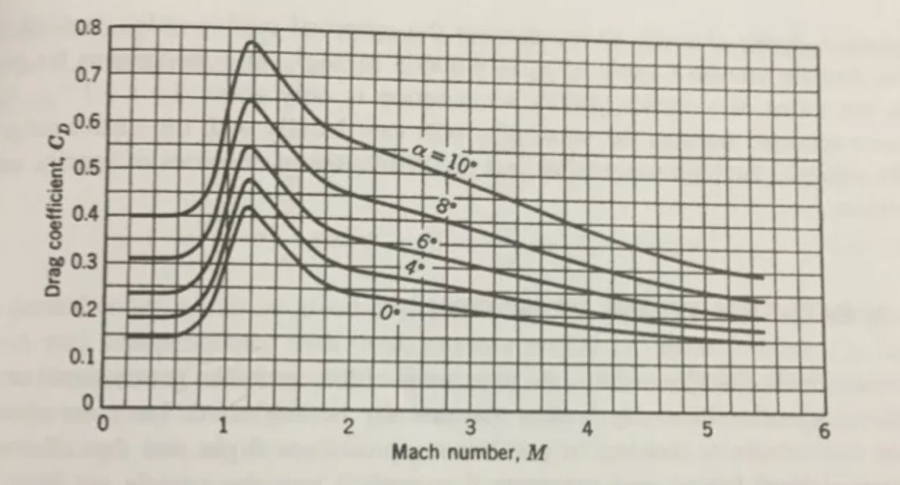

# Numerical_methods_lab3

Реализованы пункты 3а и 3b.



### Структура проекта

│  
├── 📄 Makefile - Файл для сборки проекта  
├── 📄 LICENSE - Лицензия проекта  
├── 📄 README.md - Документация проекта  
│  
├── 📄 main.cpp - Главный исполняемый файл программы  
├── 📄 main - Исполняемый файл (результат сборки)  
│  
├── 📄 coef.h - Заголовочный файл для работы с коэффициентами  
├── 📄 coef.cpp - Реализация методов для работы с коэффициентами  
│  
└── 📄 chat.jpg - Изображение (возможно, диаграмма или схема)  

### Использование

```
make
```

```
./main
```

### Результат
```
Regression coefficients:
a = 0.338043
b = 0.244549

Calculated drag coefficients:
M = 1.4: cD = 0.341434
M = 1.6: cD = 0.30321
M = 2: cD = 0.2584
M = 3.2: cD = 0.196253

Additional points:
M = 3.5: cD = 0.187031
M = 6.0: cD = 0.1417
```

### Команда
* Алметов Кирилл
* Кочетков Александр